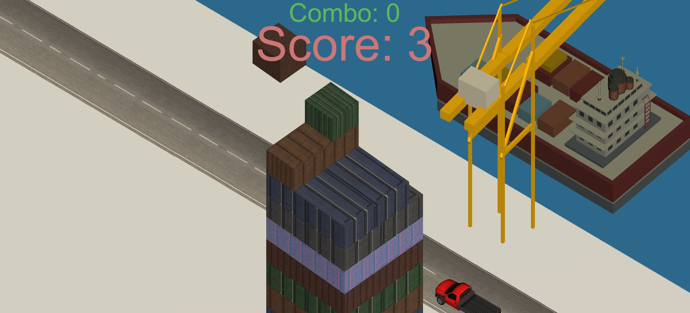
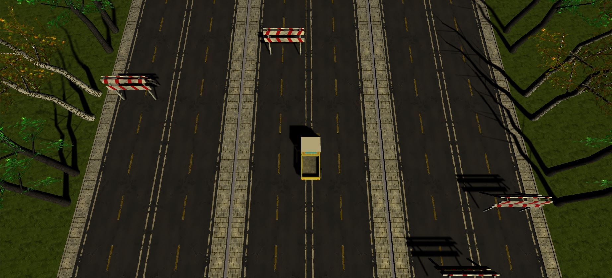
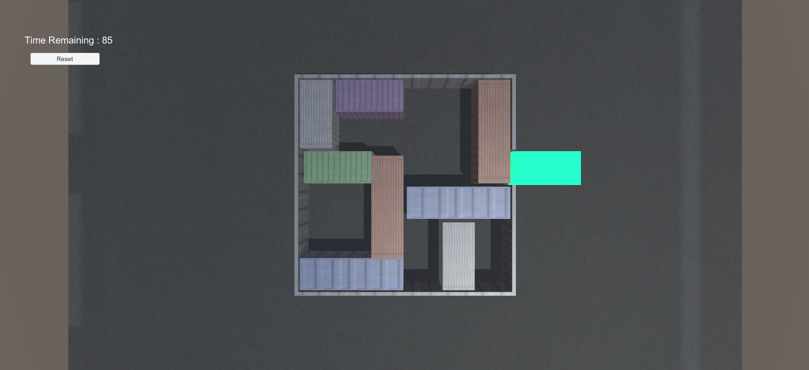

# Port Game
A port-themed unity game consisting of 3 minigames:
1. Crate Stack (assets/crate-tower)
2. Delivery Dash (assets/delivery-dash)
3. Sliding Minigame (assets/sliding-minigame)

## Getting Started

### Prerequisites

This game was built and tested on **Unity version 2017.1.1f1** so for optimal performance, use that specific version.

### Installing

Git clone from the root of this repository and add the whole directory as a new project in Unity.

## Playing the games

To play each game within the Unity Application, simply navigate to the corresponding Scenes folder in unity, select the game you wish to play and click the play button.

```
I.e. To play Crate Tower, navigate to "portgame/Assets/crate-tower/Scenes/CrateTower and run the scene within.
```
The 3 minigames are part of an overarching main game in which you earn coins to build a port. Have fun!

## Details about each minigame

### Crate Tower


The objective is to stack crates into a tower as accurately as possible. Each time a crate is not perfectly placed, a portion of it drops off. The game ends when a block is completely misplaced such that it falls off the tower.

### Delivery Dash


By tilting the phone, the player can control a vehicle. The objective is to travel the furthest distance as fast as possible without hitting any obstacle.

### Sliding minigame


A classic block sliding minigame in which the goal is to navigate a truck to the goal point by moving other blocks in the way.

## Deployment

To build and deploy the whole game as an Android application, refer to the following site for detailed instructions on doing so.
https://learn.unity.com/tutorial/building-for-mobile#5c7f8528edbc2a002053b4a2

## Built With

* [Unity](https://unity.com/) - Unity's real-time 3D development platform


